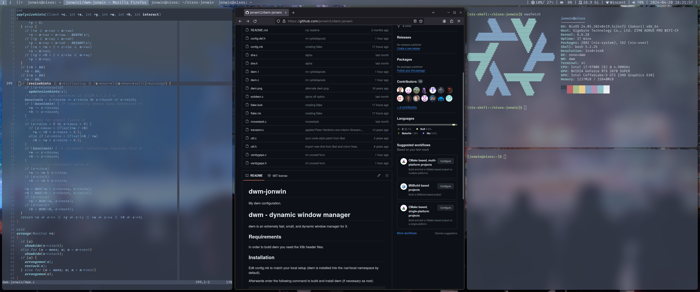

# DWM Jonwin

My dwm configuration with flake.

dwm is an extremely fast, small, and dynamic window manager for X.

## Table of contents

- [NixOS install](#nixos-install)
- [Regular Install](#regulat-install)
    - [Requirements](#requirements)
    - [Installation](#installation)
    - [Running dwm](#running-dwm)
- [Installed patches](#installed-patches)
- [Notes](#notes)

---

## NixOS Install

Add this repo as a flake input in your flake.nix:

    inputs = {
        dwm = {
            url = "github:jonwin1/dwm-jonwin";
            inputs.nixpkgs.follows = "nixpkgs";
        };
    };

Then add the following to your configuration.nix to enable dwm:

    services = {
        xserver = {
            windowManager.dwm = {
                enable = true;
                package = inputs.dwm.packages."x86_64-linux".default;
            };
        };
    };

## Regular Install

### Requirements

In order to build dwm you need the Xlib header files.

### Installation

Edit config.mk to match your local setup (dwm is installed into
the /usr/local namespace by default).

Afterwards enter the following command to build and install dwm (if
necessary as root):

    make clean install

### Running dwm

Add the following line to your .xinitrc to start dwm using startx:

    exec dwm

In order to connect dwm to a specific display, make sure that
the DISPLAY environment variable is set correctly, e.g.:

    DISPLAY=foo.bar:1 exec dwm

(This will start dwm on display :1 of the host foo.bar.)

In order to display status info in the bar, you can do something
like this in your .xinitrc:

    while xsetroot -name "`date` `uptime | sed 's/.*,//'`"
    do
    	sleep 1
    done &
    exec dwm

## Installed patches

- **[alpha](https://dwm.suckless.org/patches/alpha/):** Translucent bar.
- **[alwayscenter](https://dwm.suckless.org/patches/alwayscenter/):** All floating windows are centered.
- **[attachbottom](https://dwm.suckless.org/patches/attachbottom/):** New clients attach at the bottom of the stack instead of the top.
- **[center first window](https://dwm.suckless.org/patches/center_first_window/):** Center window if only one window is open.
- **[exitmenu](https://dwm.suckless.org/patches/exitmenu/):** Simple exit menu for dwm.
- **[fancybar](https://dwm.suckless.org/patches/fancybar/):** Show title of all visible windows.
- **[flextile...](https://github.com/bakkeby/dwm-vanitygaps/blob/master/patches/dwm-flextile-pertag-cfacts-vanitygaps-grid-centered-6.2.diff):** Patch containing custom versions of the following patches:
    - **flextile:** A flexible layout.
    - **pertag:** Layout and etc on a per tag basis.
    - **cfacts:** Provides the ability to assign different weights to clients.
    - **vanitygaps:** Flexible gaps between client windows and between windows and the screen edge.
    - **grid:** Place clients in a grid.
- **[hide vacant tags](https://dwm.suckless.org/patches/hide_vacant_tags/):** Hide tags with no clients from bar.
- **[movestack](https://dwm.suckless.org/patches/movestack/):** Move clients around in the stack.
- **[restartsig](https://dwm.suckless.org/patches/restartsig/):** Allows restarting of dwm.
- **[scratchpad](https://dwm.suckless.org/patches/scratchpad/):** Spawn or restore a floating terminal window.
- **[swallow](https://dwm.suckless.org/patches/swallow/):** Terminals swallow windows opened by child processes.
- **[viewontag](https://dwm.suckless.org/patches/viewontag/):** Follow a window to the tag it is being moved to.

## Notes

Customize [config.def.h](./config.def.h) to fit your system and needs.

You may need to change the path to wpctl and light to get the volume and brightness
keys to work on non NixOS systems.

